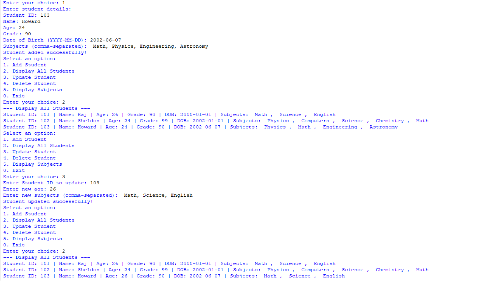
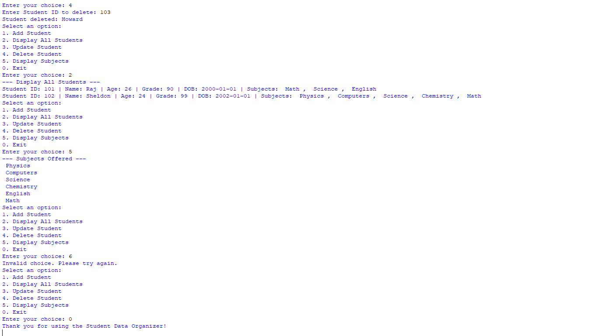

# Student Data Organizer – Python Project

## 📌 Project Overview
The **Student Data Organizer** is a menu-driven Python program designed to manage student records using basic data structures.

This project allows the user to add, view, update, and delete student information. It also provides an option to display all subjects offered by students in the system.

The main goal of this project is to **practice core Python concepts** such as dictionaries, tuples, sets, loops, and conditional statements while building a practical console application.

---

## 🎯 Why This Project Was Created
This project was created to:
- Understand how real-world data (student records) can be stored in Python
- Learn how to organize related data using **dictionaries**
- Use **tuples** as unique identifiers for records
- Work with **sets** to avoid duplicate subjects
- Build confidence with menu-based programs and user input handling

---

## 🧠 Concepts Used
- `print()` and `input()` functions  
- Variables and data types  
- Dictionaries (to store student records)  
- Tuples (to uniquely identify students using ID and DOB)  
- Sets (to store subjects without duplicates)  
- `while` loop (for continuous menu execution)  
- `for` loop (to iterate through students and subjects)  
- Conditional statements (`if / elif / else`)  

---

## ⚙️ How the Program Works

When the program starts, it displays a menu with the following options:

Add Student

Display All Students

Update Student

Delete Student

Display Subjects

Exit


The program continues running until the user selects **Exit**.

---

## 🧩 Menu Options Explained

### 1️⃣ Add Student
- Prompts the user to enter:
  - Student ID
  - Name
  - Age
  - Grade
  - Date of Birth
  - Subjects (comma-separated)
- Creates a **tuple (Student ID, Date of Birth)** as a unique key
- Stores all student details in a dictionary
- Uses a **set** to store subjects so duplicates are avoided

---

### 2️⃣ Display All Students
- Displays all stored student records
- Shows:
  - Student ID
  - Name
  - Age
  - Grade
  - Date of Birth
  - Subjects (formatted neatly)
- Converts the subject set into a readable list format for output

---

### 3️⃣ Update Student
- Asks for a Student ID
- Searches for the matching student record
- Allows updating:
  - Age
  - Subjects
- Confirms when the update is successful
- Displays a message if the student is not found

---

### 4️⃣ Delete Student
- Prompts for a Student ID
- Removes the student record if it exists
- Displays the name of the deleted student
- Handles cases where the student does not exist

---

### 5️⃣ Display Subjects
- Collects all subjects from every student
- Displays a unique list of subjects offered
- Uses a **set** to ensure no duplicate subjects appear

---

### 0️⃣ Exit
- Ends the program safely
- Displays a thank-you message

---

## ▶️ How to Run the Program
1. Make sure Python 3 is installed on your system  
2. Download or clone this repository  
3. Open a terminal or command prompt in the project folder  
4. Run the program using:

```bash
python student_data_organizer.py
📝 Notes
The program runs continuously until the Exit option is selected

Input values affect the output shown

No external libraries are used

The project focuses on logic and data handling, not GUI

👤 Author
Dash

🖥️ Program Output Screenshots
The screenshots below show the complete execution of the program, including:

Adding a student

Displaying all students

Updating student data

Deleting a student

Displaying subjects

Exiting the program

📸 Screenshot 1
```


```
📸 Screenshot 2
```

```
Note: Output may vary depending on user input.
